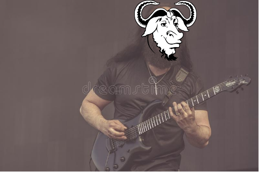

# LibreGuitar

CLI application that recognizes notes played on a guitar through the sound interface. This project
is still in very early development stages. Some of the possible upcoming features might include:
1. real time tablature generation, either of your own playing or of some audio files
  * conversely, it might also be possible to compare the accuracy of your playing to a given tablature
2. chord detection
3. intervallic fretboard navigation exercises
4. music theory component that include scale, arpeggio or chord exercises

None of these ideas have exactly laid-out implementation plans as of yet.

# Installation
## Docker Image
Upcoming, work-in-progress

## Windows Binaries
Upcoming, work-in-progress

## Linux
### System Dependencies
* libasound2-dev (ALSA)
* libjack-dev libjack0 (JACK)
  * Will be made optional in the future

### Steps
1. Install `Rust` toolchain
  * See https://www.rust-lang.org/tools/install for a quick installation guide.
2. Clone this repository
3. Run `cargo run --release`. If all the system dependencies are met, this command
should build and run the application. After choosing the audio subsystem (host) and
the device, real-time note detection process should begin.
